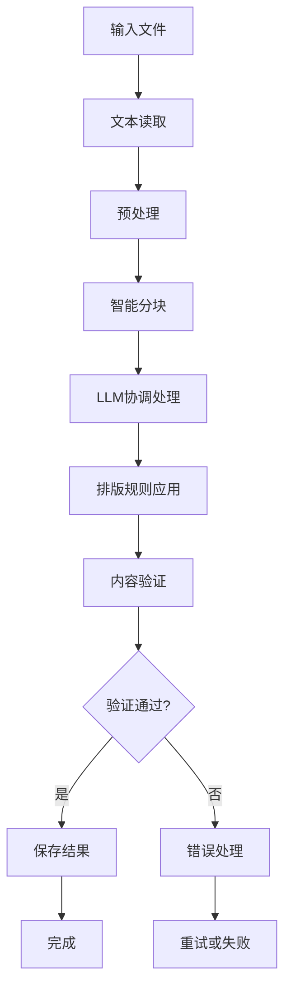

# 大卫排版应用程序架构说明

## 项目结构

```
david/
├── main.py                    # 主程序入口
├── run.py                     # 启动脚本
├── install.py                 # 安装脚本
├── test_david.py              # 测试脚本
├── requirements.txt           # 依赖包列表
├── README.md                  # 项目说明
├── ARCHITECTURE.md            # 架构说明
├── start_david.bat            # Windows启动脚本
├── start_david.sh             # Unix启动脚本
├── config/                    # 配置目录
│   ├── settings.py            # 设置管理模块
│   └── settings.json          # 配置文件
├── core/                      # 核心模块
│   ├── text_processor.py      # 文本处理模块
│   ├── llm_coordinator.py     # LLM协调器
│   ├── formatting_engine.py   # 排版引擎
│   └── content_validator.py   # 内容验证器
├── ui/                        # 用户界面
│   └── main_interface.py      # 主界面
├── examples/                  # 示例文件
│   └── sample_text.txt        # 示例文本
├── logs/                      # 日志目录
├── output/                    # 输出目录
└── temp/                      # 临时文件目录
```

## 核心模块说明

### 1. 主程序 (main.py)
- **DavidApp类**: 应用程序主类
- **ProcessingResult类**: 处理结果数据类
- **功能**: 协调各个模块，提供统一的处理接口

### 2. 文本处理模块 (core/text_processor.py)
- **TextProcessor类**: 文本处理器
- **功能**: 
  - 文本读取和预处理
  - 智能分块处理
  - 文本结构分析
  - 标题格式标准化

### 3. LLM协调器 (core/llm_coordinator.py)
- **LLMCoordinator类**: LLM协调器
- **LLMConfig类**: LLM配置类
- **ProcessingTask类**: 处理任务类
- **功能**:
  - 多LLM协调处理
  - 任务分配和调度
  - 并发处理管理
  - 错误重试机制

### 4. 排版引擎 (core/formatting_engine.py)
- **FormattingEngine类**: 排版引擎
- **FormattingRule类**: 排版规则类
- **功能**:
  - 排版规则管理
  - 文本格式化处理
  - 多格式输出支持
  - 格式化验证

### 5. 内容验证器 (core/content_validator.py)
- **ContentValidator类**: 内容验证器
- **ValidationResult类**: 验证结果类
- **功能**:
  - 内容完整性验证
  - 相似度计算
  - 结构完整性检查
  - 特殊内容验证

### 6. 用户界面 (ui/main_interface.py)
- **MainInterface类**: 主界面类
- **功能**:
  - 交互式用户界面
  - 文件处理向导
  - 进度显示
  - 结果展示

### 7. 设置管理 (config/settings.py)
- **Settings类**: 设置管理类
- **功能**:
  - 配置管理
  - 设置验证
  - 动态配置更新
  - 配置导入导出

## 处理流程



## 数据流

1. **输入阶段**
   - 文件读取 → 文本预处理 → 结构分析

2. **处理阶段**
   - 文本分块 → LLM协调处理 → 结果合并

3. **格式化阶段**
   - 排版规则应用 → 格式转换 → 后处理

4. **验证阶段**
   - 内容完整性检查 → 相似度验证 → 结构验证

5. **输出阶段**
   - 结果保存 → 统计报告 → 日志记录

## 关键特性

### 1. 多LLM协调
- 支持多个LLM服务并行处理
- 智能任务分配和负载均衡
- 故障转移和重试机制

### 2. 内容完整性保证
- 多层次内容验证
- 相似度计算和阈值控制
- 结构完整性检查

### 3. 智能排版
- 规则引擎驱动的格式化
- 支持多种输出格式
- 可扩展的排版规则

### 4. 用户友好
- 交互式界面
- 进度显示和状态反馈
- 详细的错误信息和日志

### 5. 可配置性
- 灵活的配置管理
- 支持多种LLM服务
- 可调整的处理参数

## 扩展性设计

### 1. 模块化架构
- 各模块独立，松耦合
- 易于替换和扩展
- 清晰的接口定义

### 2. 插件化支持
- LLM服务插件化
- 排版规则可扩展
- 输出格式可定制

### 3. 配置驱动
- 基于配置的功能控制
- 运行时参数调整
- 多环境支持

## 性能优化

### 1. 并发处理
- 多线程文本处理
- 异步LLM调用
- 并行内容验证

### 2. 内存管理
- 流式文本处理
- 临时文件管理
- 内存使用监控

### 3. 缓存机制
- 处理结果缓存
- 配置缓存
- 临时文件缓存

## 错误处理

### 1. 分层错误处理
- 模块级错误捕获
- 应用级错误恢复
- 用户级错误提示

### 2. 日志记录
- 分级日志记录
- 详细错误信息
- 性能监控日志

### 3. 故障恢复
- 自动重试机制
- 降级处理策略
- 数据备份和恢复

